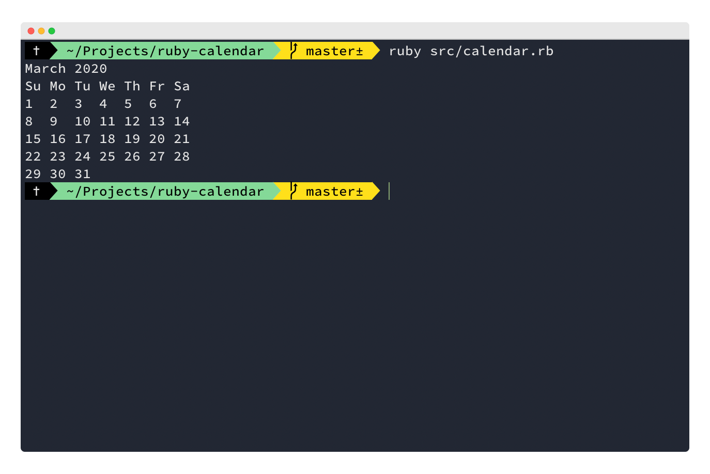

# Calendar in ruby

Ruby script that attempts to replicate the `cal` command on a MacOS terminal.


## Current Status

Currently, the script prints out the calendar for the current month (at the time of execution). It does not currently take month/year as arguments. 

## Run the script

To run the script, navigate inside the root of the project folder and run

```bash
  ruby src/calendar.rb
```


## Approach 

As I haven't used Ruby for over a year, I opted for a procedural approach, splitting my code into smaller functions (making unit testing easy) and using an orchestrator to orchestrate the smaller functions to return the desired result.

I attempted to extend the program to accept arguments (using `ARGV` to get the argument array), however I ran out of time while trying to parse the arguments into a new date object. 
